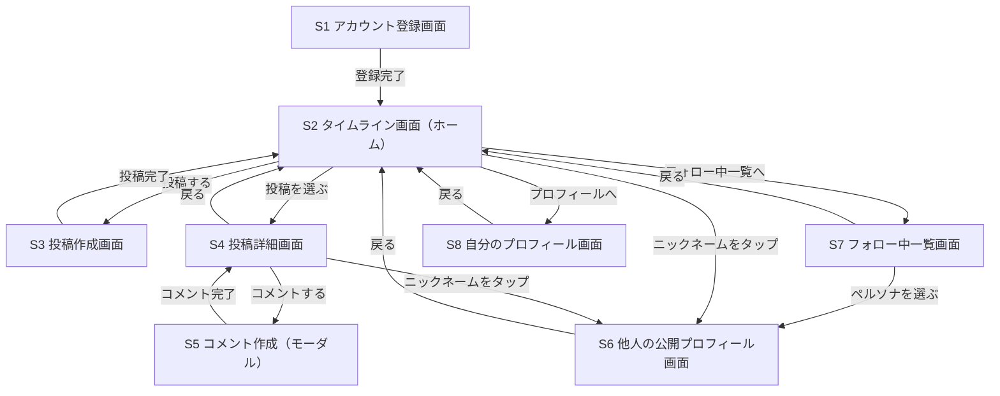

# 吐露SNS（仮称）全体設計書

> 本ドキュメントはハッカソン向けチーム開発のための「全体設計書」です。詳細な実装仕様（ウォーターフォール的な仕様書）ではなく、**サービスのビジョン・目的・ターゲット・アイディア**をチームで共有するためのドキュメントとして位置づけます。アジャイル開発を前提とし、実装の詳細は各担当エンジニアの裁量と今後のスプリントで詰めていきます。

---

## 1. サービスビジョン・コンセプト

### 1.1 一言コンセプト
「弱音を吐いていい場所と、それを受け止めたい人をつなぐ、エンジニアのための本音吐露SNS」

### 1.2 背景・課題意識
- エンジニアは日々、納期・コードレビュー・技術的負債・オンコール対応など、慢性的な認知負荷とプレッシャーにさらされている。
- 社内では弱音や愚痴を吐きにくく、X（Twitter）などのオープンなSNSでは特定・炎上・キャリアへの影響リスクがあり、本音を出しにくい。
- 結果として、ストレスを溜め込み、現実逃避したい気持ちの行き場がない。

### 1.3 提供価値
- **安心して現実逃避できる場**：本名や所属を晒さず、日々の愚痴・弱音・もやもやをそのまま吐き出せる。
- **一方通行で終わらせない**：投稿を「受け止めたい」誰かに届け、共感というリアクションを返す仕組みを用意する。
- **役割ベースの心理的マッチング**：「甘えたい（幼児退行タイプ）」側と「受け止めたい（庇護欲タイプ）」側という、対になる心理的欲求をマッチングさせることで、双方に居場所を作る。

---

## 2. ターゲットユーザー像

このSNSでは「赤ちゃん」「お母さん」という対になる2つのロール（役割）でユーザーの心理的欲求を捉える。重要なのは、これは**ユーザーに固定で割り当てられる属性ではなく、行動（投稿する／コメントする）のたびに選べるモード**だという点（詳細は3章の権限マトリクス参照）。

| ペルソナ（心理的な軸） | 特徴 | このSNSに求めるもの |
| --- | --- | --- |
| **赤ちゃん（甘えたい・幼児退行タイプ）** | 疲弊していて、駄々をこねたい・弱音を吐きたい・頑張りを認めてほしい。承認より共感が欲しい。 | 否定されずに愚痴を聞いてもらえる、よしよしされる体験 |
| **お母さん（受け止めたい・庇護欲タイプ）** | 人の話を聞くのが好き、後輩の面倒を見るのが得意、誰かの役に立ちたい欲求がある。 | 誰かに頼られる・感謝される体験、自分の存在意義の実感 |

※自分の投稿（吐露）は誰であっても常に「赤ちゃん」として行う。一方、他人の投稿へのコメントでは「赤ちゃん（同じ立場で共感する）」「お母さん（労って受け止める）」のどちらの声で応じるかをその都度選べる。つまり同じユーザーが、ある投稿では吐露する赤ちゃんになり、別の投稿では誰かを労うお母さんになる、という切り替えを前提にした設計。

---

## 3. コア体験・機能一覧

コア体験は「愚痴を吐露する → 誰かが受け止める」という一連の流れ。**投稿（吐露）機能が最も重要な体験であり、フォロー・レコメンド・リアクションはそれを成立させるための補助機能**という優先順位で設計する。

### 3.1 ロールと権限マトリクス
「赤ちゃん」「お母さん」は固定の属性ではなく、行動のたびに選ぶモード。権限は次の通り。

| ロール＼行動 | 投稿（ポスト） | コメント |
| --- | --- | --- |
| 赤ちゃん | ○ 可 | ○ 可 |
| お母さん | × 不可 | ○ 可 |

- 新規の投稿（吐露）は必ず「赤ちゃん」として行う（「お母さん」として自分から投稿することはできない）。
- 他人の投稿へのコメントでは、「赤ちゃん」として共感するか「お母さん」として労うかを、コメントごとに選べる。

### 3.2 アカウントとペルソナの分離（重要な設計方針）
1つのアカウントは、内部的には単一の持ち主だが、外部から見える公開アイデンティティとして**「赤ちゃんペルソナ」（投稿・赤ちゃんコメント用）と「お母さんペルソナ」（お母さんコメント用）の2つ**を持つ。この2つは、ニックネームなども含めて独立した見た目を持ち、**他のユーザーからは同一アカウントに紐づいていることが分からない**ようにする。両ペルソナのステータスをまとめて確認できるのは、本人が自分のプロフィール画面を開いたときだけ。

- フォロー機能は「ユーザー」単位ではなく「ペルソナ」単位で行う：お気に入りの赤ちゃんペルソナ／お気に入りのお母さんペルソナを個別にフォローし、その投稿・コメントを見に行くことができる。
- フォロワー一覧（誰が自分をフォローしているか）はどちらのペルソナに対しても非公開（フォロワー数も含めて表示しない）。

### 3.3 プロフィール画面
自分専用のプロフィール画面では、赤ちゃんペルソナとお母さんペルソナ両方のステータスを確認できる（他人からは見えない自分専用ビュー）。

- **赤ちゃん度（推定年齢）**：自分の投稿・赤ちゃんコメントの文章をAIが分析し、「何歳児くらいの赤ちゃんらしさか」を年齢の目安として表示する。
- **お母さん度（推定対象年齢）**：自分のお母さんコメントの文章をAIが分析し、「何歳児くらいの赤ちゃんに向けてよしよし・優しいコメントをしているか」を年齢の目安として表示する。

いずれも7章の`POST /api/ai/evaluate`の結果を、ペルソナ単位で集計して表示するイメージ。

### 3.4 MVP（ハッカソンで実装するコア機能）
1. **投稿（吐露）機能**：テキストで愚痴・弱音を投稿。任意でタグ（疲労度・種類など）を付与。常に「赤ちゃんペルソナ」として投稿。
2. **タイムライン表示・似た境遇レコメンド**：投稿一覧をタイムラインとして取得・表示する。単純な新着順ではなく、閲覧者（自分の赤ちゃんペルソナ）と近い推定年齢・近い悩みで幼児退行している、他の赤ちゃんペルソナの投稿を優先的に含めるレコメンドロジックをMVPから組み込む。「受け止め役」を紹介するものではなく、似た境遇の赤ちゃん同士が出会いやすくするための機能。
3. **コメント機能**：他人の投稿に対して、「赤ちゃんペルソナ」または「お母さんペルソナ」を選んでコメントできる。
4. **フォロー機能**：お気に入りの赤ちゃんペルソナ／お母さんペルソナをフォローできる。フォローは一方向で、フォロワー（人数含む）は非公開。
5. **やさしいリアクション**：「いいね」に相当する反応として、**おぎゃー・ばぶばぶ・よしよし**の3種類のスタンプを用意する。攻撃的・否定的なリアクションは作らない。
6. **AIによる文章評価機能**：投稿・コメントの文章から「何歳児くらいの赤ちゃんらしさか／何歳児向けのお母さんらしさか」をAIが年齢で評価する。この評価結果は2.のタイムラインレコメンドの類似度判定にも使う。
7. **AIによる文章変換機能**：自分が普通に書いた文章を、「赤ちゃん言葉」または「お母さん言葉」に変換してくれる、評価とは別の生成系の補助機能。
8. **プロフィール画面**：自分の赤ちゃんペルソナ／お母さんペルソナの推定年齢ステータスをまとめて確認できる（3.3参照）。

### 3.5 拡張機能（MVPの先、余力があれば）
- 自分の愚痴・ストレス傾向の可視化
- 生成AIによる共感コメントの自動生成・要約

> **注記（スコープ外）**：ダイレクトメッセージ（DM）機能は設けない。フォローや「似た境遇レコメンド」は、投稿・コメント・リアクションというロールプレイの範囲内で完結させ、そこから閉じた1対1のやり取りに発展させる機能は持たない前提。

---

## 4. 画面構成・画面遷移図

3章の機能を実現するための最低限の画面構成。詳細なUIデザインは各画面を担当するエンジニアの裁量とし、ここでは画面の一覧と遷移の全体像のみを示す。

### 4.1 画面一覧
| ID | 画面名 | 概要 |
| --- | --- | --- |
| S1 | アカウント登録画面 | 赤ちゃんペルソナ・お母さんペルソナのニックネームを設定してアカウントを作成する |
| S2 | タイムライン画面（ホーム） | 似た境遇レコメンドを含む投稿フィード。他の画面への主な入り口 |
| S3 | 投稿作成画面 | 赤ちゃんペルソナとして愚痴を投稿する。テキストに加えてスタンプも挿入できる。AI文章変換（赤ちゃん言葉化）を呼び出せる |
| S4 | 投稿詳細画面 | 投稿本文、リアクション（おぎゃー／ばぶばぶ／よしよし）、コメント一覧を表示 |
| S5 | コメント作成画面（モーダル） | 赤ちゃん／お母さんペルソナを選んでコメントする。AI文章変換をここでも呼び出せる |
| S6 | 他人の公開プロフィール画面 | あるペルソナ（赤ちゃん or お母さん）の公開情報と投稿／コメント一覧、フォローボタン |
| S7 | フォロー中一覧画面 | 自分がフォローしている赤ちゃんペルソナ／お母さんペルソナの一覧（本人専用） |
| S8 | 自分のプロフィール画面 | 赤ちゃんペルソナ／お母さんペルソナ両方の推定年齢ステータスをまとめて確認（本人専用） |

### 4.2 画面遷移図（Mermaid）


### 4.3 画面遷移に関する補足
- S4（投稿詳細）やS2（タイムライン）で投稿者・コメント者のニックネームをタップすると、そのペルソナ単独のS6（公開プロフィール）に遷移する。
- S6経由では、同一アカウントに紐づくもう一方のペルソナには絶対に遷移できない（3.2節の非連結の原則をUI上でも守る）。
- S6上の「フォローする／フォロー解除」は画面遷移を伴わないその場のアクションのため、上図には含めていない。
- S8（自分のプロフィール）だけが、赤ちゃんペルソナ／お母さんペルソナ両方のステータスを同時に表示する唯一の画面。

---

## 5. 全体アーキテクチャ概要

```mermaid
flowchart TD
    FE["フロントエンド\n(HTML/CSS/JS or React+TS+Vite)\n技術は担当エンジニアの裁量"]
    BE["バックエンドAPI\nTypeScript / Deno\n(Deno Deployにデプロイ)"]
    DB["Deno KV\n(データベース)"]
    AI["AI推論API\nPython / PyTorch・scikit-learn\n(Hugging Faceにデプロイ)"]

    FE -->|HTTPS (JSON)| BE
    BE --> DB
    BE --> AI
```

- **フロントエンド**：技術選定は未定・担当エンジニアに一任（本ドキュメントではスコープ外）。
- **バックエンドAPI**：TypeScriptで実装し、Deno上で独立したAPIとして構築・デプロイする。アカウントと赤ちゃん／お母さん両ペルソナの紐づけを内部で管理し、その紐づけを外部のレスポンスに含めない責務を持つ（3.2参照）。
- **データベース**：Deno KV（キーバリューストア）。
- **AI処理**：Python（PyTorch, scikit-learn）で実装し、Hugging Face上にデプロイした独立の推論APIとしてバックエンドから呼び出す。用途は大きく2種類：①文章が「赤ちゃんらしいか／お母さんらしいか」をスコアリングする**評価**、②書いた文章を赤ちゃん言葉・お母さん言葉に書き換える**変換**。
- **生成AIの扱い（未定事項）**：外部の生成AI APIを使うか、ローカルLLMを使うかは今後の検討課題（詳細は10章）。

---

## 6. データ設計（Deno KV）

Deno KVはリレーショナルDBではなくキーバリューストアのため、ER図ではなく**「キー構造表」**で表現する。Deno KVは配列によるキー（例：`["posts", postId]`）と、セカンダリインデックス用のキー（例：`["posts_by_user", userId, postId]`）を組み合わせて設計するのが定石。

### 6.1 エンティティとキー構造

3.2節の通り、1アカウントは赤ちゃんペルソナ／お母さんペルソナという2つの公開アイデンティティを持つ。`accountId`は内部でこの2つを紐づけるためだけに使い、外部レスポンスには含めない。

| エンティティ | プライマリキー | 値（value）の概要 | セカンダリインデックス（用途） |
| --- | --- | --- | --- |
| アカウント | `["accounts", accountId]` | `{ id, createdAt }`（認証情報など内部専用の最小限の情報） | ― |
| 赤ちゃんペルソナ | `["baby_personas", babyPersonaId]` | `{ id, accountId, nickname, bio, createdAt }`（`accountId`は内部専用、他ユーザーには非公開） | `["baby_personas_by_account", accountId, babyPersonaId]`（内部専用：本人が自分のペルソナを引くため） |
| お母さんペルソナ | `["mother_personas", motherPersonaId]` | `{ id, accountId, nickname, bio, createdAt }`（同上、`accountId`は非公開） | `["mother_personas_by_account", accountId, motherPersonaId]`（内部専用） |
| 投稿（愚痴） | `["posts", postId]` | `{ id, babyPersonaId, body, stamps: [{ stampId, position }], tags[], mood, createdAt }`（常に赤ちゃんペルソナとしての投稿。`stamps`は本文に挿入したスタンプの参照リスト） | `["posts_by_persona", babyPersonaId, postId]`（ペルソナ別の投稿一覧） |
| スタンプ（マスタ） | `["stamps", stampId]` | `{ id, name, imageUrl, createdAt }`（投稿に挿入できるスタンプのカタログ。おぎゃー／ばぶばぶ／よしよし等のリアクションとは別物） | ― |
| コメント | `["comments", postId, commentId]` | `{ id, personaType: "baby"\|"mother", personaId, body, createdAt }` | `["comments_by_persona", personaType, personaId, commentId]`（ペルソナ別のコメント一覧） |
| リアクション | `["reactions", postId, reactionId]` | `{ reactorAccountId, type: "ogya"\|"babu"\|"yoshiyoshi", createdAt }` | ― |
| フォロー | `["follows", followerAccountId, targetPersonaType, targetPersonaId]` | `{ createdAt }` | `["followed_by", targetPersonaType, targetPersonaId, followerAccountId]`（**内部利用限定**。フィード生成・通知用の内部インデックスであり、フォロワーの身元・人数を返すAPIは提供しない） |
| ペルソナ年齢評価（集計） | `["persona_age_estimates", personaType, personaId]` | `{ estimatedAge, sampleCount, updatedAt }`（プロフィール画面表示用の集計値） | ― |

### 6.2 設計方針
- 投稿本文はテキストのみでなく、スタンプ（`stamps`）を組み合わせられる。スタンプ自体は`stamps`エンティティにカタログとして持ち、投稿側は`stampId`の配列で参照する（画像本体を投稿ごとに複製しない）。
- 一覧取得が必要なもの（例：あるペルソナの投稿一覧、自分がフォローしているペルソナ一覧）は、Deno KVの`list()`機能を使えるよう、プレフィックス検索可能なセカンダリインデックスキーを用意する。
- `followed_by`インデックスは「誰が自分をフォローしているか」を可視化しないための内部設計上の割り切り。フィードへの表示や通知トリガーには使うが、ユーザーに返すレスポンスには含めない。
- 赤ちゃんペルソナ・お母さんペルソナが同一`accountId`に紐づくという情報は、本人が自分のプロフィールを見るとき（`GET /api/profile/me`、7章参照）以外では組み合わせて返さないことを設計上の原則とする。
- 値のスキーマは実装フェーズで柔軟に調整可能とし、ここでは最低限のフィールドのみ定義する（アジャイルのため厳密な型定義は各スプリントで確定）。

---

## 7. API設計

エンドポイントごとに**引数（リクエスト）と戻り値（レスポンス）のJSON形式のみ**を定義する。内部の処理ロジック（レコメンドアルゴリズムやAI連携の詳細）はあえて抽象的なままにし、実装フェーズで詰める。

| エンドポイント | 概要 |
| --- | --- |
| `POST /api/accounts` | アカウント登録（赤ちゃんペルソナ・お母さんペルソナを同時に作成） |
| `GET /api/stamps` | 投稿に挿入できるスタンプのカタログ取得（スタンプピッカー表示用） |
| `GET /api/profile/me` | 自分の赤ちゃんペルソナ／お母さんペルソナのステータスをまとめて取得（本人専用） |
| `GET /api/personas/baby/:id` / `GET /api/personas/mother/:id` | 他人から見える、それぞれのペルソナの公開プロフィール取得（`accountId`は含まない） |
| `POST /api/posts` | 愚痴投稿の作成（常に赤ちゃんペルソナとして投稿） |
| `GET /api/posts/feed` | タイムライン（投稿フィード）取得。閲覧者と近い推定年齢・近い悩みの投稿を優先表示するレコメンドロジックを内包する |
| `POST /api/posts/:id/comments` | 投稿へのコメント作成（赤ちゃん／お母さんペルソナを選択） |
| `POST /api/posts/:id/reactions` | 投稿へのリアクション（おぎゃー／ばぶばぶ／よしよし） |
| `POST /api/follows` | ペルソナ（赤ちゃん or お母さん）をフォロー |
| `GET /api/follows/me` | 自分がフォローしているペルソナ一覧の取得（本人のみ参照可。フォロワー一覧・人数を返すAPIは提供しない） |
| `POST /api/ai/evaluate` | 文章の「赤ちゃん度／お母さん度」を年齢の目安としてAIが評価 |
| `POST /api/ai/transform` | 文章を赤ちゃん言葉・お母さん言葉に変換 |

### 7.1 リクエスト/レスポンス例

**`POST /api/accounts`（アカウント登録、両ペルソナを同時作成）**
```json
// Request
{
  "babyNickname": "string",
  "motherNickname": "string"
}
// Response
{
  "accountId": "string",
  "babyPersonaId": "string",
  "motherPersonaId": "string",
  "createdAt": "string (ISO8601)"
}
```
> `accountId`はログイン・内部管理用。以降の投稿・コメント・フォローなどのAPI呼び出しでは、`accountId`ではなく`babyPersonaId`／`motherPersonaId`を使う想定。

**`GET /api/profile/me`（自分のプロフィール、両ペルソナをまとめて取得）**
```json
// Response
{
  "babyPersona": { "id": "string", "nickname": "string", "estimatedAge": "number" },
  "motherPersona": { "id": "string", "nickname": "string", "estimatedAge": "number" }
}
```
> 本人しか呼べないエンドポイント。赤ちゃんペルソナとお母さんペルソナが同一アカウントに紐づくという情報を返すのは、この本人専用エンドポイントだけという原則。

**`GET /api/stamps`（スタンプカタログ取得）**
```json
// Response
{
  "stamps": [
    { "id": "string", "name": "string", "imageUrl": "string" }
  ]
}
```

**`POST /api/posts`（投稿作成、常に赤ちゃんペルソナとして投稿。テキスト＋スタンプ）**
```json
// Request
{
  "babyPersonaId": "string",
  "body": "string",
  "stamps": [
    { "stampId": "string", "position": "number (optional, 本文中の挿入位置)" }
  ],
  "tags": ["string"],
  "mood": "string (optional)"
}
// Response
{
  "id": "string",
  "createdAt": "string (ISO8601)"
}
```
> `body`は空文字列でも可とし、スタンプだけの投稿も許容する想定（詳細な入力バリデーションは実装フェーズで検討）。

**`GET /api/posts/feed`（タイムライン取得、似た境遇レコメンドを内包）**
```json
// Request（クエリパラメータ）
{
  "viewerBabyPersonaId": "string",
  "cursor": "string (optional, ページングカーソル)",
  "limit": "number (optional)"
}
// Response
{
  "posts": [
    { "postId": "string", "similarityScore": "number (optional)" }
  ],
  "nextCursor": "string (optional)"
}
```
> 処理概要：閲覧者（自分の赤ちゃんペルソナ）の推定年齢・投稿傾向に近い、他の赤ちゃんペルソナの投稿を優先的に含めて並べる。新着順との混ぜ方や具体的なランキングロジックは実装フェーズで検討（まずはシンプルなルールベースでも良い）。

**`POST /api/posts/:id/comments`（コメント作成、ペルソナを選択）**
```json
// Request
{
  "personaType": "baby | mother",
  "personaId": "string",
  "body": "string"
}
// Response
{
  "id": "string",
  "createdAt": "string (ISO8601)"
}
```

**`POST /api/posts/:id/reactions`（やさしいリアクション）**
```json
// Request
{
  "reactorAccountId": "string",
  "type": "ogya | babu | yoshiyoshi"
}
// Response
{
  "id": "string",
  "createdAt": "string (ISO8601)"
}
```

**`POST /api/follows`（ペルソナをフォロー、一方向）**
```json
// Request
{
  "followerAccountId": "string",
  "targetPersonaType": "baby | mother",
  "targetPersonaId": "string"
}
// Response
{
  "createdAt": "string (ISO8601)"
}
```
> 補足：フォロワー（自分を誰がフォローしているか、その人数も含む）を返すエンドポイントは意図的に用意しない。`GET /api/follows/me`は本人が「自分は誰をフォローしているか」を確認するためのものであり、他人のフォロー先を見るためのものではない想定。

**`GET /api/follows/me`（自分がフォローしているペルソナ一覧）**
```json
// Response
{
  "followingBabies": [{ "babyPersonaId": "string" }],
  "followingMothers": [{ "motherPersonaId": "string" }]
}
```

**`POST /api/ai/evaluate`（文章の赤ちゃん度／お母さん度を年齢で評価）**
```json
// Request
{
  "body": "string",
  "personaType": "baby | mother"
}
// Response
{
  "estimatedAge": "number（何歳児相当かの目安。赤ちゃんペルソナの場合は文章自体の幼さ、お母さんペルソナの場合はコメントが向いている相手の年齢の目安）"
}
```
> 処理概要：投稿・コメントの保存時、およびプロフィール画面の集計値更新時に呼び出す想定。具体的な評価モデル・ロジックは実装フェーズで検討。

**`POST /api/ai/transform`（文章を赤ちゃん言葉／お母さん言葉に変換）**
```json
// Request
{
  "body": "string",
  "style": "baby | mother"
}
// Response
{
  "transformedText": "string"
}
```
> 評価（evaluate）とは独立した、生成系の補助機能。ユーザーが普通に書いた文章を投稿・コメント前に変換して使うことを想定。

---

## 8. 開発の進め方（アジャイル・ハッカソン前提）

- チーム構成例：フロント担当／バックエンド（TS・Deno）担当／AI・ML担当（Python）
- 短いイテレーションで、コア体験（投稿 → コメント／リアクション）を最速で一本通すことを最優先とし、フォロー・プロフィール画面・タイムラインレコメンド・AI変換は後から積み増す。
- AI評価・AI変換は最初は簡易ロジック（キーワードベースなど）で良く、後からPyTorch/scikit-learnのモデルに差し替えられる設計にしておく（`/api/ai/evaluate`・`/api/ai/transform`のインターフェースさえ守れば内部実装は差し替え可能）。
- 生成AIの活用は必須ではなく、余力に応じて段階的に組み込む拡張要素として扱う。

---

## 9. プライバシー・心理的安全性への最低限の配慮

- 実名・所属会社名などの特定情報を書かせないガイドラインを表示する。
- 誹謗中傷・晒し行為を防ぐため、投稿の削除機能は最低限用意する（通報機能は拡張スコープ）。
- 「弱音を吐く場」という性質上、否定的・攻撃的なリアクションを設計上作らない（できるのは「おぎゃー・ばぶばぶ・よしよし」等の肯定的反応のみ）。
- **フォロワーの非公開**：誰が自分をフォローしているか（人数も含む）は本人にも分からない設計とし、監視されている感覚や気まずさを生まないようにする（6章・7章参照）。
- **ペルソナ間の非連結**：赤ちゃんペルソナとお母さんペルソナが同一アカウントに紐づいているという情報は、本人以外には一切見せない（3.2章参照）。
- **DM機能を持たない**：フォローや似た境遇レコメンドをきっかけに、閉じた1対1のチャットへ発展する導線は意図的に作らない。ロールプレイ上の関わりを投稿・コメント・リアクションの範囲に限定することで、なりすまし・個別の迷惑行為のリスクを抑える。

---

## 10. 今後決めること（オープンイシュー）

- 生成AI処理を外部API（例：Claude API等）に任せるか、ローカルLLMを使うか。
- フロントエンドの技術選定（HTML/CSS/JS か React+TypeScript+Vite か）は担当エンジニアが決定。
- 本格運用を見据えた場合のスケーラビリティ・モデレーション体制の検討。
- サービス名（仮称のまま。候補：ぐちっこ／よしよしSNS／ネロネロ など、チームで決定）。

