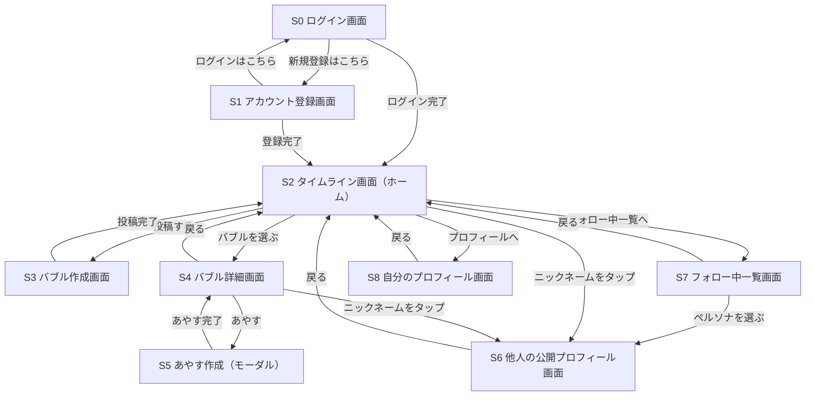
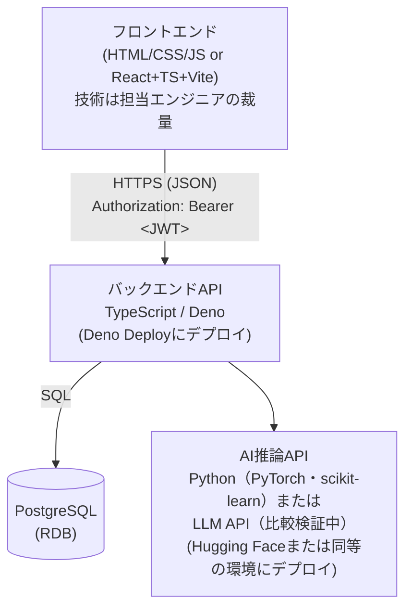
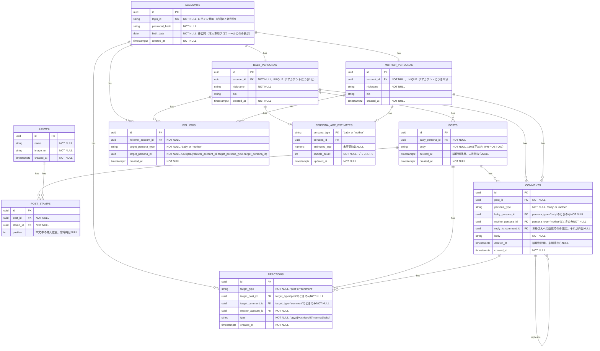

# 「えんじいろ」全体設計書

> 本ドキュメントはハッカソン向けチーム開発のための「全体設計書」です。詳細な実装仕様（ウォーターフォール的な仕様書）ではなく、**サービスのビジョン・目的・ターゲット・アイディア**をチームで共有するためのドキュメントとして位置づけます。アジャイル開発を前提とし、実装の詳細は各担当エンジニアの裁量と今後のスプリントで詰めていきます。

> **正本**：本ファイルの`main`ブランチ版を全体設計書の正本とします。[Notion版](https://app.notion.com/p/3c355ed83675802bba97d1d4fb502d5b?pvs=204)は共有用ミラーとし、GitHubでレビュー・マージされた内容を後から同期します。

> **文書の位置づけ**：本書が満たすべき要件は `docs/specification.md`（全体仕様書）で確定されています。本書と全体仕様書が矛盾する場合は全体仕様書を優先し、本書側を修正してください。仕様IDへの参照は該当箇所に `FR-xxx` / `NFR-xxx` の形式で付記します。

---

## 1. サービスビジョン・コンセプト

### 1.1 一言コンセプト

「弱音を吐いていい場所と、それを受け止めたい人をつなぐ、エンジニアのための本音吐露SNS」

### 1.2 背景・課題意識

- エンジニアは日々、納期・コードレビュー・技術的負債・オンコール対応など、慢性的な認知負荷とプレッシャーにさらされている。
- 社内では弱音や愚痴を吐きにくく、X（Twitter）などのオープンなSNSでは特定・炎上・キャリアへの影響リスクがあり、本音を出しにくい。
- 結果として、ストレスを溜め込み、現実逃避したい気持ちの行き場がない。

### 1.3 提供価値

- **安心して現実逃避できる場**：本名や所属を晒さず、日々の愚痴・弱音・もやもやをそのまま吐き出せる。
- **一方通行で終わらせない**：投稿を「受け止めたい」誰かに届け、共感というリアクションを返す仕組みを用意する。
- **役割ベースの心理的マッチング**：「甘えたい（幼児退行タイプ）」側と「受け止めたい（庇護欲タイプ）」側という、対になる心理的欲求をマッチングさせることで、双方に居場所を作る。

---

## 2. ターゲットユーザー像

このSNSでは「赤ちゃん」「お母さん」という対になる2つのロール（役割）でユーザーの心理的欲求を捉える。重要なのは、これは**ユーザーに固定で割り当てられる属性ではなく、行動（バブルを投稿する／あやす）のたびに選べるモード**だという点（詳細は3章の権限マトリクス参照）。

| ペルソナ（心理的な軸）                     | 特徴                                                                                       | このSNSに求めるもの                                  |
| ------------------------------------------ | ------------------------------------------------------------------------------------------ | ---------------------------------------------------- |
| **赤ちゃん（甘えたい・幼児退行タイプ）**   | 疲弊していて、駄々をこねたい・弱音を吐きたい・頑張りを認めてほしい。承認より共感が欲しい。 | 否定されずに愚痴を聞いてもらえる、よしよしされる体験 |
| **お母さん（受け止めたい・庇護欲タイプ）** | 人の話を聞くのが好き、後輩の面倒を見るのが得意、誰かの役に立ちたい欲求がある。             | 誰かに頼られる・感謝される体験、自分の存在意義の実感 |

※自分の吐露（バブル）は誰であっても常に「赤ちゃん」として行う。一方、他人のバブルへの返信（あやす）では「赤ちゃん（同じ立場で共感する）」「お母さん（労って受け止める）」のどちらの声で応じるかをその都度選べる。つまり同じユーザーが、あるバブルには吐露する赤ちゃんになり、別のバブルには誰かを労うお母さんになる、という切り替えを前提にした設計。

---

## 3. コア体験・機能一覧

コア体験は「愚痴を吐露する（バブル） →
誰かが受け止める（あやす）」という一連の流れ。**バブル投稿機能が最も重要な体験であり、フォロー・レコメンド・リアクションはそれを成立させるための補助機能**という優先順位で設計する。

### 3.1 ロールと権限マトリクス

「赤ちゃん」「お母さん」は固定の属性ではなく、行動のたびに選ぶモード。権限は次の通り（FR-COMMON-002、8章）。

| ロール＼行動 | バブルの投稿 | あやす |
| ------------ | -------------- | -------- |
| 赤ちゃん     | ○ 可           | ○ 可     |
| お母さん     | × 不可（FR-POST-003） | ○ 可（下記の制約あり） |

- 新規のバブルは必ず「赤ちゃん」として行う（「お母さん」として自分から投稿することはできない）。
- 他人のバブルへのあやすでは、「赤ちゃん」として共感するか「お母さん」として労うかを、あやすごとに選べる（FR-COMMENT-001）。
- **お母さんとしてのあやすに対して返信する場合、選択できるペルソナは赤ちゃんのみである。** お母さんとしてのあやすへお母さんペルソナで返信することはできない（FR-COMMENT-005〜007）。この制約は画面上の選択肢の非表示だけでなく、サーバ側でも常に検証する（クライアントを改変した不正なリクエストも拒否する）。
- バブルの投稿・あやす・リアクション・フォローは、いずれも**認証済み（ログイン済み）の利用者のみ**が行える（FR-COMMON-001）。

### 3.2 アカウントとペルソナの分離（重要な設計方針）

1つのアカウントは、内部的には単一の持ち主だが、外部から見える公開アイデンティティとして**「赤ちゃんペルソナ」（バブル・赤ちゃんとしてのあやす用）と「お母さんペルソナ」（お母さんとしてのあやす用）の2つ**を持つ。この2つは、ニックネームなども含めて独立した見た目を持ち、**他のユーザーからは同一アカウントに紐づいていることが分からない**ようにする（FR-PERSONA-001〜004）。両ペルソナのステータスをまとめて確認できるのは、本人が自分のプロフィール画面を開いたときだけ（FR-PERSONA-005）。

- フォロー機能は「ユーザー」単位ではなく「ペルソナ」単位で行う：お気に入りの赤ちゃんペルソナ／お気に入りのお母さんペルソナを個別にフォローし、そのバブル・あやすを見に行くことができる（FR-FOLLOW-001）。
- フォロワー一覧（誰が自分をフォローしているか）とフォロワー数は、本人を含む誰にも表示しない（FR-FOLLOW-004、FR-FOLLOW-005）。

### 3.3 アカウント登録時に登録する情報

アカウント登録時、利用者は次を入力する（4.1 S1、7.1参照）。

| 項目 | 公開・非公開 | 用途 |
| --- | --- | --- |
| ログインID（重複不可） | 非公開（内部の認証にのみ使用） | ログイン時の本人確認 |
| パスワード | 非公開 | ログイン時の本人確認 |
| 赤ちゃんペルソナのニックネーム | 公開 | 赤ちゃんペルソナの表示名 |
| お母さんペルソナのニックネーム | 公開 | お母さんペルソナの表示名 |
| **生年月日** | **非公開（本人専用プロフィールにのみ表示）** | **タイムラインの似た境遇レコメンド（3.5、FR-FEED-003）の判定材料として利用** |

生年月日は、他の利用者に見える公開プロフィール（S6）やあやす・リアクションの発信者情報には一切含めない。本人が自分の登録内容を確認できるよう、本人専用プロフィール（S8）にのみ表示する（FR-ACCOUNT-004〜006、FR-PRIV-007）。「赤ちゃん度」「お母さん度」（推定年齢、AIによる文章評価の結果）とは別の値であり、両者を混同しない。

### 3.4 プロフィール画面

自分専用のプロフィール画面では、赤ちゃんペルソナとお母さんペルソナ両方のステータスと、登録した生年月日を確認できる（他人からは見えない自分専用ビュー、FR-PROFILE-001〜002、FR-ACCOUNT-006）。

- **赤ちゃん度（推定年齢）**：自分のバブルおよび赤ちゃんとしてのあやすの文章をAIが分析し、「何歳児くらいの赤ちゃんらしさか」を年齢の目安として表示する（FR-PROFILE-003）。
- **お母さん度（推定対象年齢）**：自分のお母さんとしてのあやすの文章をAIが分析し、「何歳児くらいの赤ちゃんに向けてよしよし・優しい言葉をかけているか」を年齢の目安として表示する（FR-PROFILE-004）。

いずれも7章の`POST /api/ai/evaluate`の結果を、ペルソナ単位で集計して表示するイメージ。

他人から見える公開プロフィールには、そのペルソナ単独の公開情報とバブル・あやすの一覧のみを表示し、もう一方のペルソナの情報や生年月日は一切含めない（FR-PROFILE-005、FR-PERSONA-004、FR-PRIV-007）。

### 3.5 MVP（ハッカソンで実装するコア機能）

1. **アカウント登録・ログイン**：ログインID・パスワード・生年月日・両ペルソナのニックネームでアカウントを作成する（FR-ACCOUNT-001〜006）。登録済みの利用者はログインID・パスワードで再度ログインできる（FR-AUTH-003〜005）。
2. **バブル（吐露）機能**：テキストで愚痴・弱音を投稿する。本文は最終的に150文字以内でなければ保存できない（FR-POST-002）。常に「赤ちゃんペルソナ」として投稿する（FR-POST-001、FR-POST-003）。
3. **タイムライン表示・似た境遇レコメンド**：バブル一覧をタイムラインとして取得・表示する。単純な新着順にはしない（FR-FEED-002）。閲覧者（自分の赤ちゃんペルソナ）と近い推定年齢・近い悩みで幼児退行している、他の赤ちゃんペルソナのバブルを優先的に含めるレコメンドロジックをMVPから組み込む（FR-FEED-003）。「受け止め役」を紹介するものではなく、似た境遇の赤ちゃん同士が出会いやすくするための機能。削除済みのバブルは含めない（FR-FEED-004）。
4. **あやす機能**：他人のバブルに対して、「赤ちゃんペルソナ」または「お母さんペルソナ」を選んであやせる（FR-COMMENT-001〜003）。お母さんとしてのあやすへ返信する場合は、赤ちゃんペルソナのみ選択できる（3.1参照）。
5. **フォロー機能**：お気に入りの赤ちゃんペルソナ／お母さんペルソナをフォローできる。フォローは一方向で、フォロワー（人数含む）は非公開（FR-FOLLOW-001〜005）。
6. **やさしいリアクション**：「いいね」に相当する反応として、**対象によって利用できる種類が異なる**リアクションを用意する（9.1参照）。
   - バブル、および赤ちゃんとしてのあやすに対して：**おぎゃー・よしよし・まんま**の3種（通常リアクション、FR-REACT-001〜003、FR-REACT-009）。
   - お母さんとしてのあやすに対して：**ばぶー**の1種のみ（FR-REACT-005）。
   - いずれの対象にも、攻撃的・否定的なリアクションは作らない（FR-REACT-008）。
7. **AIによる文章評価機能**：バブル・あやすの文章から「何歳児くらいの赤ちゃんらしさか／何歳児向けのお母さんらしさか」をAIが年齢で評価する（FR-AI-EVAL-001〜004）。この評価結果は3.のタイムラインレコメンドの類似度判定にも使う。**評価結果が一定の閾値を超えなかったバブル・あやすは保存できない**（FR-AI-EVAL-007）。AI評価が利用できない状態では、閾値判定ができないためバブル・あやすの保存自体を止める（NFR-003）。
8. **AIによる文章変換機能**：自分が普通に書いた文章を、「赤ちゃん言葉」または「お母さん言葉」に変換してくれる、評価とは別の生成系の補助機能（FR-AI-001、FR-AI-TRANS-001〜009）。変換結果は自動で保存されず、利用者が確認・編集したうえで保存する（FR-AI-TRANS-006〜007）。AI文章変換（生成）が利用できない場合でも、バブル・あやすの機能自体は継続して利用できる（NFR-001）。
9. **プロフィール画面**：自分の赤ちゃんペルソナ／お母さんペルソナの推定年齢ステータスと、登録した生年月日をまとめて確認できる（3.4参照）。
10. **モデレーション**：バブル・あやすの本文、およびAI文章変換の変換前後の文章に対して、個人の特定・連絡・現実接触につながる内容や攻撃的表現がないかを検査する（9章、FR-MOD-001〜023）。

### 3.6 拡張機能（MVPの先、余力があれば）

- 自分の愚痴・ストレス傾向の可視化（OUT-006）
- 生成AIによる共感コメントの自動生成・要約（OUT-007）
- 通報機能（OUT-002）
- 未ログインユーザーに興味関心・技術領域を入力させ、それを基にした未ログイン向けタイムラインのレコメンド（4.4参照。MVPでは未ログイン時は新着順のみとする）

> **注記（スコープ外）**：ダイレクトメッセージ（DM）機能は設けない（OUT-001）。フォローや「似た境遇レコメンド」は、バブル・あやす・リアクションというロールプレイの範囲内で完結させ、そこから閉じた1対1のやり取りに発展させる機能は持たない前提。バブル・あやす本文でのURL利用もMVPでは提供しない（OUT-008、FR-MOD-021）。

---

## 4. 画面構成・画面遷移図

3章の機能を実現するための最低限の画面構成。詳細なUIデザインは各画面を担当するエンジニアの裁量とし、ここでは画面の一覧と遷移の全体像のみを示す。

### 4.1 画面一覧

| ID | 画面名                       | 概要                                                                                                                 | 未ログインでの利用 |
| -- | ---------------------------- | -------------------------------------------------------------------------------------------------------------------- | --- |
| S0 | ログイン画面                 | 登録済みのログインID・パスワードでログインする                                                                       | 利用可（ログインするための画面） |
| S1 | アカウント登録画面           | ログインID（重複不可）・パスワード・生年月日・赤ちゃんペルソナ／お母さんペルソナのニックネームを入力してアカウントを作成する | 利用可（登録するための画面） |
| S2 | タイムライン画面（ホーム）   | 似た境遇レコメンドを含むバブルのフィード。他の画面への主な入り口                                                     | **閲覧可**（4.4参照） |
| S3 | バブル作成画面               | 赤ちゃんペルソナとして愚痴を投稿する。テキストに加えてスタンプも挿入できる。150文字の残り文字数を表示し、AI文章変換（赤ちゃん言葉化）を呼び出せる。AI評価・モデレーションで拒否された場合は理由を表示する | ログイン必須 |
| S4 | バブル詳細画面               | バブル本文、リアクション（対象別に選択肢が変わる）、あやす一覧を表示                                                 | **閲覧可**（4.4参照） |
| S5 | あやす作成画面（モーダル）   | 赤ちゃん／お母さんペルソナを選んであやす。お母さんとしてのあやすへ返信する場合は赤ちゃんペルソナに固定される。AI文章変換をここでも呼び出せる | ログイン必須 |
| S6 | 他人の公開プロフィール画面   | あるペルソナ（赤ちゃん or お母さん）の公開情報とバブル／あやす一覧、フォローボタン                                   | **閲覧可**（フォローボタンの操作のみログイン必須、4.4参照） |
| S7 | フォロー中一覧画面           | 自分がフォローしている赤ちゃんペルソナ／お母さんペルソナの一覧（本人専用）                                           | ログイン必須 |
| S8 | 自分のプロフィール画面       | 赤ちゃんペルソナ／お母さんペルソナ両方の推定年齢ステータスと生年月日をまとめて確認（本人専用）                        | ログイン必須 |

### 4.2 画面遷移図（Mermaid）



### 4.3 画面遷移に関する補足

- S4（バブル詳細）やS2（タイムライン）でバブル投稿者・あやす発信者のニックネームをタップすると、そのペルソナ単独のS6（公開プロフィール）に遷移する。
- S6経由では、同一アカウントに紐づくもう一方のペルソナには絶対に遷移できない（3.2節の非連結の原則をUI上でも守る、FR-PERSONA-004）。
- S6上の「フォローする／フォロー解除」は画面遷移を伴わないその場のアクションのため、上図には含めていない。未ログインの場合はこのアクション自体を実行できない（4.4参照）。
- S8（自分のプロフィール）だけが、赤ちゃんペルソナ／お母さんペルソナ両方のステータスを同時に表示する唯一の画面（FR-PERSONA-005）。
- S3・S5でAI評価・モデレーションにより保存を拒否する場合、拒否理由は匿名性保護の趣旨が伝わる説明で表示し、判定の内部情報（NGワードの内容や判定コード）は表示しない（FR-MOD-033〜034）。
- S5でお母さんとしてのあやすに返信する場合、ペルソナ選択UIには赤ちゃんペルソナのみを表示する（FR-COMMENT-005）。

### 4.4 未ログインでの利用範囲

「弱音を吐く」という行為自体は認証済み利用者に閉じるが、**サービスの雰囲気を知ってもらうための閲覧は未ログインでも可能**にする（FR-GUEST-001〜005、詳細は`docs/specification.md` 4.2節参照）。

| 機能・画面 | 未ログインでの利用 |
| --- | --- |
| タイムライン閲覧（S2） | 可（FR-GUEST-001）。閲覧者の赤ちゃんペルソナが存在しないため、似た境遇レコメンド（FR-FEED-003）は適用せず、**新着順**で表示する（FR-GUEST-004、3.6の拡張機能参照）。 |
| バブル詳細閲覧（S4） | 可（FR-GUEST-002）。本文・リアクション件数・あやす一覧を閲覧できる。 |
| 他人の公開プロフィール閲覧（S6） | 可（FR-GUEST-003）。ペルソナ単独の公開情報とバブル／あやす一覧を閲覧できる。 |
| バブルの投稿（S3） | 不可。ログインが必要（FR-GUEST-005、FR-COMMON-001）。 |
| あやす（S5） | 不可。ログインが必要。 |
| リアクション | 不可。ログインが必要。 |
| フォロー／フォロー解除 | 不可。ログインが必要。 |
| 自分のプロフィール（S8）・フォロー中一覧（S7） | 不可。ログインが必要（本人専用画面のため）。 |

---

## 5. 全体アーキテクチャ概要



- **フロントエンド**：技術選定は未定・担当エンジニアに一任（本ドキュメントではスコープ外）。未ログイン時は認証トークンを送らずに閲覧系APIのみを呼び出す（4.4参照）。
- **バックエンドAPI**：TypeScriptで実装し、Deno上で独立したAPIとして構築・デプロイする。アカウントと赤ちゃん／お母さん両ペルソナの紐づけを内部で管理し、その紐づけを外部のレスポンスに含めない責務を持つ（3.2参照、FR-COMMON-005、FR-PRIV-004）。認証が必要な操作は`Authorization: Bearer <JWT>`ヘッダーで受け取ったトークンを検証し、リクエストボディに`accountId`や`babyPersonaId`等の身元情報を持たせない（6.4、7章参照）。バブル・あやすの保存時には、150文字制限（FR-POST-002）・モデレーション（9章）・AI評価による閾値判定（3.5-7、FR-AI-EVAL-007）をサーバ側で必ず通過させ、クライアントが申告した判定結果は信用しない（FR-MOD-004）。
- **データベース**：**PostgreSQL（RDB）**。当初はDeno KV（キーバリューストア）を前提にしていたが、リレーショナルなPostgreSQLが利用できる環境が整ったため、こちらを採用する（詳細は6章）。ホスティング先・具体的な接続方式・ORM／クエリビルダの選定は実装フェーズで決定する（10章）。
- **AI処理**：文章が「赤ちゃんらしいか／お母さんらしいか」を年齢としてスコアリングする**評価**（`/api/ai/evaluate`）と、文章を赤ちゃん言葉・お母さん言葉に書き換える**変換**（`/api/ai/transform`）の2種類を、バックエンドAPIから独立した推論APIとして呼び出す。フロントエンドから推論APIを直接呼び出すことはしない（FR-AI-002）。具体的な実装方式（自前モデルか、外部LLM APIか、どのモデルを使うか）は`ai/`配下で検証中であり、確定していない（10章のオープンイシュー）。
- **モデレーション**：バブル・あやすの保存時、およびAI文章変換の変換前後の3点で実施する。処理主体（バックエンドAPI内のルールベース処理か、AI推論APIの一部として実装するか）は実装フェーズで決定するが、いずれの場合もクライアント側の申告に依存せず、サーバ側で必ず検査する（9章、FR-MOD-001〜004）。

---

## 6. データ設計（PostgreSQL）

6章時点でDBはPostgreSQL（RDB）を前提とする。エンティティ間の関係と、各テーブルのカラム・主キー（PK）・外部キー（FK）・一意制約（UK）・NOT NULL制約をER図で示す。値の詳細な型・インデックス設計は実装フェーズ（詳細設計書）で確定し、ここでは全体設計として必要な制約を示す。

### 6.1 ER図

`PK`＝主キー、`FK`＝外部キー、`UK`＝一意制約（UNIQUE）。属性のコメント欄にNOT NULLや排他制約などの補足を記す（コメントがないカラムはNULL許容）。テーブル間の関係線は「行を持つかどうか」というデータベース上の参照関係（`has`）のみを示し、業務上の意味（誰が投稿する・誰が返信するといった振る舞い）はここには書かない。CHECK制約や「参照先の値に依存する制約」（例：あやすの`persona_type`とリアクションの対象種別の対応）はER図の記法だけでは表現しきれないため、6.2節のDDLと6.3節の文章で補足する。



### 6.2 DDL（PostgreSQL CREATE TABLE文）

6.1節のER図をそのままPostgreSQLのDDLに落としたもの。主キー・外部キー・一意制約・NOT NULL制約・CHECK制約をSQLとして確定させ、このDDLをそのまま実行すればスキーマを再現できる状態にする。列の型・桁数（`varchar`の長さ等）は実装フェーズで調整可能な仮の値とする。

```sql
create extension if not exists pgcrypto; -- gen_random_uuid() を使うため

create table accounts (
    id            uuid primary key default gen_random_uuid(),
    login_id      varchar(50)  not null unique,
    password_hash varchar(255) not null,
    birth_date    date         not null,
    created_at    timestamptz  not null default now()
);

create table baby_personas (
    id         uuid primary key default gen_random_uuid(),
    account_id uuid         not null unique references accounts (id),
    nickname   varchar(50)  not null,
    bio        text,
    created_at timestamptz  not null default now()
);

create table mother_personas (
    id         uuid primary key default gen_random_uuid(),
    account_id uuid         not null unique references accounts (id),
    nickname   varchar(50)  not null,
    bio        text,
    created_at timestamptz  not null default now()
);

create table stamps (
    id         uuid primary key default gen_random_uuid(),
    name       varchar(50) not null,
    image_url  text        not null,
    created_at timestamptz not null default now()
);

create table posts (
    id              uuid primary key default gen_random_uuid(),
    baby_persona_id uuid        not null references baby_personas (id),
    body            varchar(150) not null,
    deleted_at      timestamptz,
    created_at      timestamptz not null default now()
);

create table post_stamps (
    id       uuid primary key default gen_random_uuid(),
    post_id  uuid    not null references posts (id),
    stamp_id uuid    not null references stamps (id),
    position integer
);

create table comments (
    id                  uuid primary key default gen_random_uuid(),
    post_id             uuid        not null references posts (id),
    persona_type        varchar(6)  not null check (persona_type in ('baby', 'mother')),
    baby_persona_id     uuid references baby_personas (id),
    mother_persona_id   uuid references mother_personas (id),
    reply_to_comment_id uuid references comments (id),
    body                text        not null,
    deleted_at          timestamptz,
    created_at          timestamptz not null default now(),
    -- persona_type='baby' なら baby_persona_id のみ、'mother' なら mother_persona_id のみが埋まる
    constraint comments_persona_exclusive check (
        (persona_type = 'baby'   and baby_persona_id   is not null and mother_persona_id is null) or
        (persona_type = 'mother' and mother_persona_id is not null and baby_persona_id   is null)
    )
);

create table reactions (
    id                 uuid primary key default gen_random_uuid(),
    target_type        varchar(7)  not null check (target_type in ('post', 'comment')),
    target_post_id     uuid references posts (id),
    target_comment_id  uuid references comments (id),
    reactor_account_id uuid        not null references accounts (id),
    type               varchar(10) not null check (type in ('ogya', 'yoshiyoshi', 'manma', 'babu')),
    created_at         timestamptz not null default now(),
    -- target_type='post' なら target_post_id のみ、'comment' なら target_comment_id のみが埋まる
    constraint reactions_target_exclusive check (
        (target_type = 'post'    and target_post_id    is not null and target_comment_id is null) or
        (target_type = 'comment' and target_comment_id is not null and target_post_id    is null)
    )
);

-- 同一利用者・同一対象・同一種類のリアクションは5件まで（FR-REACT-010〜011）。
-- 集計を伴う制約はCHECK制約単体では書けないため、INSERT前トリガーで検査する。
create or replace function reactions_enforce_limit() returns trigger as $$
declare
    current_count integer;
begin
    select count(*) into current_count
    from reactions
    where reactor_account_id = new.reactor_account_id
      and target_type = new.target_type
      and target_post_id is not distinct from new.target_post_id
      and target_comment_id is not distinct from new.target_comment_id
      and type = new.type;

    if current_count >= 5 then
        raise exception 'reaction limit exceeded: max 5 per reactor/target/type (FR-REACT-011)';
    end if;

    return new;
end;
$$ language plpgsql;

create trigger reactions_limit_check
    before insert on reactions
    for each row
    execute function reactions_enforce_limit();

create table follows (
    id                   uuid primary key default gen_random_uuid(),
    follower_account_id  uuid        not null references accounts (id),
    target_persona_type  varchar(6)  not null check (target_persona_type in ('baby', 'mother')),
    target_persona_id    uuid        not null,
    created_at           timestamptz not null default now(),
    unique (follower_account_id, target_persona_type, target_persona_id)
);

create table persona_age_estimates (
    persona_type  varchar(6)   not null check (persona_type in ('baby', 'mother')),
    persona_id    uuid         not null,
    estimated_age numeric(4,1),
    sample_count  integer      not null default 0,
    updated_at    timestamptz  not null default now(),
    primary key (persona_type, persona_id)
);
```

> `comments_persona_exclusive`・`reactions_target_exclusive`は「入力された値の組み合わせ」を検査するCHECK制約であり、6.1節で触れた「参照先テーブルの行の値に依存する制約」（例：`reply_to_comment_id`が指す行の`persona_type`が`'mother'`なら自分は`'baby'`でなければならない、リアクション対象のあやすが`mother`なら`type`は`babu`のみ、というFR-COMMENT-005〜007・FR-REACT-005〜007の制約）はCHECK制約だけでは書けない。これらはPostgreSQLのトリガー（`CREATE TRIGGER` + `CREATE FUNCTION`）またはアプリケーション層でのバリデーションで担保する（6.5節参照）。`reactions_enforce_limit`トリガーは、この種の「集計を伴う制約」（同一利用者・同一対象・同一種類は5件まで、FR-REACT-010〜011）をトリガーで実装する例である。

### 6.3 テーブル定義

3.2節の通り、1アカウントは赤ちゃんペルソナ／お母さんペルソナという2つの公開アイデンティティを持つ。`accounts.id`は内部でこの2つを紐づけるためだけに使い、外部レスポンスには含めない（FR-COMMON-005、FR-PRIV-004）。6.2節のDDLと対応させながら、各テーブルの意図と仕様IDとの対応を示す。

| テーブル                 | 主なカラム                                                                                                    | 制約・備考                                                                                                                                                 |
| ------------------------ | --------------------------------------------------------------------------------------------------------------- | ------------------------------------------------------------------------------------------------------------------------------------------------------- |
| `accounts`               | `id (PK)`, `login_id (UNIQUE)`, `password_hash`, `birth_date`, `created_at`                                     | 認証情報・生年月日など内部専用の最小限の情報のみ。`login_id`はログイン用の入力ID、`id`はサーバ内部管理用のUUID（3.3、7.1参照）。いずれも外部レスポンスには一切含めない。`birth_date`は本人専用プロフィール（`GET /api/profile/me`）以外では返さない。 |
| `baby_personas`          | `id (PK)`, `account_id (FK -> accounts.id)`, `nickname`, `bio`, `created_at`                                    | `account_id`は内部専用。他ユーザーには非公開（FR-PERSONA-003）。1アカウントにつき1行のみ。                                                                  |
| `mother_personas`        | `id (PK)`, `account_id (FK -> accounts.id)`, `nickname`, `bio`, `created_at`                                    | 同上。`baby_personas`とは別テーブルとして独立させ、ニックネーム等の見た目が互いに影響しないようにする（FR-PERSONA-002）。                                    |
| `stamps`                 | `id (PK)`, `name`, `image_url`, `created_at`                                                                    | 投稿に挿入できるスタンプのカタログ（マスタ）。おぎゃー／よしよし／まんば等のリアクションとは別物。                                                          |
| `posts`（バブル）        | `id (PK)`, `baby_persona_id (FK -> baby_personas.id)`, `body (最終的に150文字以内, FR-POST-002)`, `deleted_at`, `created_at` | `deleted_at`は論理削除用（FR-POST-006、FR-POST-007、FR-FEED-004）。常に赤ちゃんペルソナからの投稿のみを許可する（FR-POST-003、アプリ層＋外部キー制約で担保）。 |
| `post_stamps`            | `id (PK)`, `post_id (FK -> posts.id)`, `stamp_id (FK -> stamps.id)`, `position`                                 | バブル本文とスタンプの中間テーブル。画像本体を投稿ごとに複製しない（FR-POST-005）。                                                                          |
| `comments`（あやす）     | `id (PK)`, `post_id (FK -> posts.id)`, `persona_type ('baby'|'mother')`, `baby_persona_id (FK, nullable)`, `mother_persona_id (FK, nullable)`, `reply_to_comment_id (FK -> comments.id, nullable)`, `body`, `deleted_at`, `created_at` | `persona_type`に応じて`baby_persona_id`／`mother_persona_id`のどちらか一方だけがNOT NULLになるようCHECK制約で排他にする。`reply_to_comment_id`が指す先が`persona_type='mother'`の行の場合、自分自身の`persona_type`は必ず`'baby'`でなければならない（FR-COMMENT-005〜007）。この参照先カラムをまたぐ制約はDBのCHECK制約だけでは表現できないため、トリガーまたはアプリ層での検証と併用する。 |
| `reactions`              | `id (PK)`, `target_type ('post'|'comment')`, `target_post_id (FK, nullable)`, `target_comment_id (FK, nullable)`, `reactor_account_id (FK -> accounts.id)`, `type ('ogya'|'yoshiyoshi'|'manma'|'babu')`, `created_at` | `target_type`に応じて`target_post_id`／`target_comment_id`のどちらか一方だけがNOT NULLになるようCHECK制約で排他にする。**対象によって許可される`type`が異なる**（9.1参照）：バブルおよび`persona_type='baby'`のあやす → `ogya`／`yoshiyoshi`／`manma`のみ、`persona_type='mother'`のあやす → `babu`のみ。この対象種別をまたぐ制約もDBのCHECK制約だけでは完結しないため、保存前にアプリ層で必ず検証する（FR-REACT-007）。同一人物・同一対象・同一`type`の行を1回のリアクションにつき1行として複数保存できるようにし、`(reactor_account_id, target_type, target_post_id, target_comment_id, type)`ごとの行数（最大5件、FR-REACT-010〜011）で上限を判定する。取り消し（FR-REACT-013）は該当する行を1件削除する形で実装する。 |
| `follows`                | `id (PK)`, `follower_account_id (FK -> accounts.id)`, `target_persona_type ('baby'|'mother')`, `target_persona_id`, `created_at` | `UNIQUE (follower_account_id, target_persona_type, target_persona_id)`。**被フォロー側からフォロワーを逆引きするAPI・クエリは提供しない**という設計上の割り切り（FR-FOLLOW-004、FR-FOLLOW-005）。DB上は技術的に可能でも、アプリケーション層で意図的に提供しない。 |
| `persona_age_estimates`  | `persona_type ('baby'|'mother')`, `persona_id`, `estimated_age`, `sample_count`, `updated_at`                   | プロフィール画面表示用の集計値。複合主キー`(persona_type, persona_id)`。赤ちゃん度・お母さん度はそれぞれ対応するペルソナの発言のみから算出する（FR-PROFILE-003〜004）。 |

### 6.4 認証・セッションの持ち方

認証には**JWT（署名付きトークン）**を採用する。

- ログイン（`POST /api/sessions`）・新規登録（`POST /api/accounts`）の成功時に、サーバの秘密鍵で署名したJWTを発行する。ペイロードは`{ accountId, iat, exp }`程度の最小限とし、生年月日やペルソナ情報等の機微な内容は含めない。
- クライアントは`Authorization: Bearer <JWT>`ヘッダーで送信する。サーバーは署名を検証し、有効期限内であれば`accountId`を取り出してリクエストを処理する。
- **JWTはステートレスであるため、DBにセッション行を持たない。** ログアウト（`DELETE /api/sessions`）はサーバ側でのトークン失効を伴わず、クライアント側がトークンを破棄するだけの操作になる。トークンは有効期限が切れるまで技術的には有効なままである点を踏まえ、有効期限は短めに設定する方針とする（具体的な期間は10章のオープンイシュー）。
- JWTのペイロードに含まれる`accountId`はランダムなUUIDであり、それ単体を読んでも赤ちゃん／お母さんペルソナの紐づけ（3.2節の非連結の原則）は分からない。ただし署名は改ざん防止のためのものであり、ペイロードの内容そのものは暗号化されず誰でも読めることを踏まえ、`accountId`以外の情報をペイロードに載せない。

### 6.5 設計方針

- KVのキー構造による非正規化ではなく、外部キー制約と正規化されたテーブルでエンティティ間の整合性をDB側でも保証する。ただし「対象によってリアクション種別が異なる」「お母さんへの返信は赤ちゃんのみ」といった**参照先の値に依存する制約**は、PostgreSQLのCHECK制約単体では完結しないため、トリガーまたはアプリケーション層のバリデーションを併用する方針とする（実装方式の詳細は各担当の裁量）。
- 一覧取得（あるペルソナのバブル一覧、自分がフォローしているペルソナ一覧など）は、外部キーにインデックスを張った通常のSQLクエリ（`WHERE` + `ORDER BY` + ページング）で実現する。
- `follows`テーブルは技術的には対象側からフォロワーを引けるが、「誰が自分をフォローしているか」を可視化しないための内部設計上の割り切りとして、そのためのAPI・クエリを一切提供しない（6.3参照）。
- 赤ちゃんペルソナ・お母さんペルソナが同一`account_id`に紐づくという情報は、本人が自分のプロフィールを見るとき（`GET /api/profile/me`、7章参照）以外では組み合わせて返さないことを設計上の原則とする。
- 禁止内容を検出した本文（モデレーション違反として拒否された原文）は、恒久的なレコードとして`posts`・`comments`テーブルに保存しない（FR-PRIV-002）。一時的な検査処理の入力としてのみ扱い、永続化しない。
- 値のスキーマは実装フェーズで柔軟に調整可能とし、ここでは最低限のカラムのみ定義する（アジャイルのため厳密な型定義・インデックス設計は各スプリントで確定）。

---

## 7. API設計

エンドポイントごとに**引数（リクエスト）と戻り値（レスポンス）のJSON形式のみ**を定義する。内部の処理ロジック（レコメンドアルゴリズムやAI連携の詳細）はあえて抽象的なままにし、実装フェーズで詰める。

認証が必要なエンドポイントは、リクエストボディに`accountId`・`babyPersonaId`・`reactorAccountId`等の身元情報を含めない。代わりに`Authorization: Bearer <JWT>`ヘッダーで送られたトークンから、サーバー側で操作主体（アカウント・該当ペルソナ）を解決する（6.4参照）。未認証で認証必須のエンドポイントを呼んだ場合は拒否する（FR-COMMON-001）。

| エンドポイント                                                | 概要                                                                                                             | 認証 |
| ------------------------------------------------------------- | ---------------------------------------------------------------------------------------------------------------- | --- |
| `POST /api/accounts`                                          | アカウント登録（ログインID・パスワード・生年月日の登録と、赤ちゃんペルソナ・お母さんペルソナの同時作成） | 不要 |
| `POST /api/sessions`                                           | ログイン（ログインID・パスワードで認証し、トークンを発行） | 不要 |
| `DELETE /api/sessions`                                         | ログアウト（クライアント側でトークンを破棄する。JWTのためサーバ側の即時失効は伴わない） | 必要 |
| `GET /api/stamps`                                              | バブルに挿入できるスタンプのカタログ取得（スタンプピッカー表示用）                                                 | 不要 |
| `GET /api/profile/me`                                          | 自分の赤ちゃんペルソナ／お母さんペルソナのステータスと生年月日をまとめて取得（本人専用）                          | 必要 |
| `GET /api/personas/baby/:id` / `GET /api/personas/mother/:id` | 他人から見える、それぞれのペルソナの公開プロフィール取得（`accountId`・生年月日は含まない）                       | 不要 |
| `POST /api/posts`                                              | バブルの作成（常に赤ちゃんペルソナとして投稿。AI評価の閾値判定・モデレーションを通過したもののみ保存）             | 必要 |
| `GET /api/posts/feed`                                          | タイムライン（バブルのフィード）取得。ログイン時は閲覧者と近い推定年齢・近い悩みのバブルを優先表示、未ログイン時は新着順（4.4参照） | 不要 |
| `GET /api/posts/:id`                                           | バブル詳細の取得（本文、リアクション集計、あやす一覧へのリンクを含む）                                            | 不要 |
| `DELETE /api/posts/:id`                                        | 自分のバブルの削除（論理削除）。他人のバブルへの削除要求は拒否する                                                 | 必要 |
| `POST /api/posts/:id/comments`                                 | バブルへのあやすの作成（赤ちゃん／お母さんペルソナを選択。お母さんへの返信の場合は赤ちゃんペルソナのみ許可）        | 必要 |
| `GET /api/posts/:id/comments`                                  | バブルに対するあやす一覧の取得                                                                                    | 不要 |
| `POST /api/posts/:id/reactions`                                | バブルへのリアクション（おぎゃー／よしよし／まんま）。同一種類は1人5回まで                                        | 必要 |
| `DELETE /api/posts/:id/reactions/:type`                        | バブルへのリアクションを1回分取り消す                                                                             | 必要 |
| `POST /api/comments/:id/reactions`                             | あやすへのリアクション（対象が赤ちゃんとしてのあやすなら3種、お母さんとしてのあやすなら`ばぶー`のみ）。同一種類は1人5回まで | 必要 |
| `DELETE /api/comments/:id/reactions/:type`                     | あやすへのリアクションを1回分取り消す                                                                             | 必要 |
| `POST /api/follows`                                            | ペルソナ（赤ちゃん or お母さん）をフォロー                                                                        | 必要 |
| `GET /api/follows/me`                                          | 自分がフォローしているペルソナ一覧の取得（本人のみ参照可。フォロワー一覧・人数を返すAPIは提供しない）             | 必要 |
| `POST /api/ai/evaluate`                                        | 文章の「赤ちゃん度／お母さん度」を年齢の目安としてAIが評価                                                        | 必要 |
| `POST /api/ai/transform`                                       | 文章を赤ちゃん言葉・お母さん言葉に変換                                                                            | 必要 |

### 7.1 リクエスト/レスポンス例

**`POST /api/accounts`（アカウント登録、両ペルソナを同時作成）**

```json
// Request
{
  "loginId": "string（ユーザーが指定するログイン用のID。重複不可）",
  "password": "string",
  "birthDate": "string (YYYY-MM-DD)",
  "babyNickname": "string",
  "motherNickname": "string"
}
// Response
{
  "babyPersona": { "id": "string", "nickname": "string" },
  "motherPersona": { "id": "string", "nickname": "string" },
  "token": "string（JWT。以降のAuthorizationヘッダーで使う）",
  "createdAt": "string (ISO8601)"
}
```

> `loginId`はユーザーが指定するログイン用のID、サーバ内部の管理用ID（`accountId`）とは別物であり、レスポンスにも`accountId`は含めない（6.4参照）。以降の認証必須のAPI呼び出しは、リクエストボディにIDを含めず`Authorization: Bearer <token>`ヘッダーで行う。
>
> **未確定**：`loginId`・`password`のバリデーション規則（文字種・長さ）、パスワードのハッシュ化方式、生年月日のバリデーション（未来日付や極端な高齢の扱い）、トークンの具体的な有効期限は未確定（10章）。

**`POST /api/sessions`（ログイン）**

```json
// Request
{
  "loginId": "string",
  "password": "string"
}
// Response（成功時、200）
{
  "babyPersona": { "id": "string", "nickname": "string" },
  "motherPersona": { "id": "string", "nickname": "string" },
  "token": "string（JWT）"
}
// Response（失敗時、401）
{
  "error": "string（IDが存在しない場合とパスワードが違う場合を区別しないメッセージ）"
}
```

> ログインIDが存在しない場合とパスワードが誤っている場合を区別せずに認証を拒否する（総当たりでログインIDの存在を調べられないようにするため）。

**`DELETE /api/sessions`（ログアウト）**

```json
// Response（204 No Content）
```

> JWTはステートレスなためサーバ側の強制失効は行わない。クライアント側で保持しているトークンを破棄することでログアウト状態を表現する。

**`GET /api/profile/me`（自分のプロフィール、両ペルソナと生年月日をまとめて取得）**

```json
// Response
{
  "birthDate": "string (YYYY-MM-DD)",
  "babyPersona": {
    "id": "string",
    "nickname": "string",
    "estimatedAge": "number"
  },
  "motherPersona": {
    "id": "string",
    "nickname": "string",
    "estimatedAge": "number"
  }
}
```

> 本人しか呼べないエンドポイント。赤ちゃんペルソナとお母さんペルソナが同一アカウントに紐づくという情報や生年月日を返すのは、この本人専用エンドポイントだけという原則（FR-PERSONA-005、FR-PRIV-007）。

**`GET /api/stamps`（スタンプカタログ取得）**

```json
// Response
{
  "stamps": [
    { "id": "string", "name": "string", "imageUrl": "string" }
  ]
}
```

**`POST /api/posts`（バブル作成、常に赤ちゃんペルソナとして投稿。テキスト＋スタンプ）**

```json
// Request
{
  "body": "string（最終的に150文字以内でなければ保存されない, FR-POST-002）",
  "stamps": [
    { "stampId": "string", "position": "number (optional, 本文中の挿入位置)" }
  ]
}
// Response（保存できた場合）
{
  "id": "string",
  "createdAt": "string (ISO8601)"
}
// Response（AI評価の閾値未達、またはモデレーション違反で拒否された場合）
{
  "error": "string（匿名性保護等の趣旨が伝わる理由。内部の判定コードや辞書内容は含めない, FR-MOD-033〜034）"
}
```

> 投稿者（赤ちゃんペルソナ）はトークンから解決するため、リクエストボディに`babyPersonaId`は含めない。`body`は空文字列でも可とし、スタンプだけの投稿も許容する想定。保存前に必ずサーバ側で150文字制限・AI評価の閾値判定（FR-AI-EVAL-007）・モデレーション（9章）を行い、クライアントが送ってきた事前チェック結果があっても信用しない（FR-MOD-004）。

**`GET /api/posts/feed`（タイムライン取得、似た境遇レコメンドを内包）**

```json
// Request（クエリパラメータ）
{
  "cursor": "string (optional, ページングカーソル)",
  "limit": "number (optional)"
}
// Response
{
  "posts": [
    { "postId": "string", "similarityScore": "number (optional)" }
  ],
  "nextCursor": "string (optional)"
}
```

> `Authorization`ヘッダーがある場合はそのトークンから閲覧者の赤ちゃんペルソナを解決し、推定年齢・投稿傾向に近い、他の赤ちゃんペルソナのバブルを優先的に含めて並べる（FR-FEED-002〜003）。**ヘッダーがない場合（未ログイン）は、似た境遇レコメンドを行わず新着順で返す**（FR-GUEST-004、4.4参照）。削除済みのバブルは含めない（FR-FEED-004）。新着順との混ぜ方や具体的なランキングロジックは実装フェーズで検討。

**`GET /api/posts/:id`（バブル詳細取得）**

```json
// Response
{
  "id": "string",
  "babyPersonaId": "string",
  "body": "string",
  "stamps": [{ "stampId": "string", "position": "number" }],
  "reactionCounts": { "ogya": "number", "yoshiyoshi": "number", "manma": "number" },
  "createdAt": "string (ISO8601)"
}
```

> 削除済みのバブルを要求した場合は取得できない（FR-POST-006）。未ログインでも取得できる（FR-GUEST-002、4.4参照）。

**`DELETE /api/posts/:id`（自分のバブルの削除）**

```json
// Response
{
  "deletedAt": "string (ISO8601)"
}
```

> 自分のバブルのみ削除できる。他人のバブルへの削除要求は拒否する（FR-POST-006〜007）。

**`POST /api/posts/:id/comments`（あやす作成、ペルソナを選択）**

```json
// Request
{
  "personaType": "baby | mother",
  "body": "string",
  "replyToCommentId": "string (optional, お母さんとしてのあやすに返信する場合に指定)"
}
// Response（保存できた場合）
{
  "id": "string",
  "createdAt": "string (ISO8601)"
}
```

> あやすの発信ペルソナはトークンの`accountId`と`personaType`から解決するため、`personaId`はリクエストに含めない。`replyToCommentId`が指すあやすが`personaType: "mother"`の場合、このリクエストの`personaType`は`"baby"`以外を受け付けない。`"mother"`を指定した場合はサーバ側で拒否する（クライアント側の非表示だけに頼らない、FR-COMMENT-005〜007）。

**`GET /api/posts/:id/comments`（あやす一覧取得）**

```json
// Response
{
  "comments": [
    {
      "id": "string",
      "personaType": "baby | mother",
      "personaId": "string",
      "body": "string",
      "replyToCommentId": "string (optional)",
      "createdAt": "string (ISO8601)"
    }
  ]
}
```

> 発信者情報から、同一アカウントのもう一方のペルソナを特定できる情報は含まない（FR-COMMENT-004）。未ログインでも取得できる（FR-GUEST-002、4.4参照）。

**`POST /api/posts/:id/reactions`（バブルへのやさしいリアクション）**

```json
// Request
{
  "type": "ogya | yoshiyoshi | manma"
}
// Response（保存できた場合）
{
  "id": "string",
  "createdAt": "string (ISO8601)",
  "counts": {
    "ogya": { "total": "number", "mine": "number" },
    "yoshiyoshi": { "total": "number", "mine": "number" },
    "manma": { "total": "number", "mine": "number" }
  }
}
// Response（同一種類で自分の送信回数が5回に達している場合）
{
  "error": "string（上限に達している旨のメッセージ）"
}
```

> リアクションを送った利用者はトークンから解決するため、リクエストボディに`reactorAccountId`は含めない。バブルに対しては通常リアクション3種（おぎゃー／よしよし／まんま）のみを受け付ける。`babu`を指定した場合は保存しない（FR-REACT-003〜004、FR-REACT-007）。同一利用者・同一種類のリアクションは5回まで送信でき、6回目は保存しない（FR-REACT-010〜011）。応答の`counts`は、種類ごとの全利用者の合計送信回数（`total`）と自分の送信回数（`mine`）を含む（FR-REACT-012）。

**`DELETE /api/posts/:id/reactions/:type`（バブルへのリアクションを1回分取り消す）**

```json
// Response
{
  "counts": {
    "ogya": { "total": "number", "mine": "number" },
    "yoshiyoshi": { "total": "number", "mine": "number" },
    "manma": { "total": "number", "mine": "number" }
  }
}
```

> 自分が送信した`:type`のリアクションのうち1回分を取り消す。自分の送信回数が0の場合は何も起きない（FR-REACT-013）。

**`POST /api/comments/:id/reactions`（あやすへのやさしいリアクション）**

```json
// Request
{
  "type": "ogya | yoshiyoshi | manma | babu"
}
// Response（保存できた場合）
{
  "id": "string",
  "createdAt": "string (ISO8601)",
  "counts": {
    "type": "number (total)",
    "mine": "number"
  }
}
```

> 対象のあやすが赤ちゃんとしてのものなら`ogya`／`yoshiyoshi`／`manma`のみ、お母さんとしてのものなら`babu`のみを受け付ける。対象と種別の組み合わせが許可されていない場合は、クライアントの申告に関わらずサーバ側で保存を拒否する（FR-REACT-005〜007）。同一利用者・同一種類のリアクションは5回まで送信でき、6回目は保存しない（FR-REACT-010〜011）。

**`DELETE /api/comments/:id/reactions/:type`（あやすへのリアクションを1回分取り消す）**

```json
// Response
{
  "counts": {
    "type": "number (total)",
    "mine": "number"
  }
}
```

> 自分が送信した`:type`のリアクションのうち1回分を取り消す（FR-REACT-013）。

**`POST /api/follows`（ペルソナをフォロー、一方向）**

```json
// Request
{
  "targetPersonaType": "baby | mother",
  "targetPersonaId": "string"
}
// Response
{
  "createdAt": "string (ISO8601)"
}
```

> フォローする利用者はトークンから解決するため、`followerAccountId`はリクエストに含めない。補足：フォロワー（自分を誰がフォローしているか、その人数も含む）を返すエンドポイントは意図的に用意しない。

**`GET /api/follows/me`（自分がフォローしているペルソナ一覧）**

```json
// Response
{
  "followingBabies": [{ "babyPersonaId": "string" }],
  "followingMothers": [{ "motherPersonaId": "string" }]
}
```

**`POST /api/ai/evaluate`（文章の赤ちゃん度／お母さん度を年齢で評価）**

```json
// Request
{
  "body": "string",
  "personaType": "baby | mother"
}
// Response
{
  "estimatedAge": "number（何歳児相当かの目安。赤ちゃんペルソナの場合は文章自体の幼さ、お母さんペルソナの場合はあやすが向いている相手の年齢の目安）",
  "passesThreshold": "boolean（この評価結果が保存を許可する閾値を満たすか。FR-AI-EVAL-007〜008）"
}
```

> 処理概要：バブル・あやすの保存時に必ず呼び出し、`passesThreshold`が`false`の場合は保存を拒否する（FR-AI-EVAL-007、NFR-003）。AI評価自体が利用できない場合も、閾値判定ができない以上は保存を止める（NFR-003）。閾値はバックエンドのみが保持し、フロントエンドには渡さない（FR-AI-EVAL-008）。フロントエンドはこの合否を受け取り、送信前に「このまま投稿できます／できません」を表示できる（Issue #19）。プロフィール画面の集計値更新時にも呼び出す想定。
>
> **決定（2026-08-25、Issue #19）**：`passesThreshold`は、ナイーブベイズによる「赤ちゃん／お母さん／その他」3クラス分類器（`ai/src/style_classifier.py`）が算出する、投稿の`personaType`に対応するクラスの確率（度合い、0〜100）が**50を超えるかどうか**で判定する。分類器の学習データは`engiiro/naive-bayes-sample`で作られた実データ11,525件（赤ちゃん3,855／お母さん3,869／その他3,801、比率1:1:1）を同じロジックのまま移した。`estimatedAge`（年齢の目安）とは独立した別の判定軸であり、`estimatedAge`自体の算出方法は引き続き簡易ロジックのプレースホルダーのまま（`ai/src/evaluate.py`）。

**`POST /api/ai/transform`（文章を赤ちゃん言葉／お母さん言葉に変換）**

```json
// Request
{
  "body": "string",
  "style": "baby | mother"
}
// Response
{
  "action": "allow | block",
  "transformedText": "string | null",
  "reasonCodes": ["string"]
}
```

- `allow`：利用できる変換候補を`transformedText`に返す。
- `block`：安全に提示できる変換候補がない状態。`transformedText`は`null`とする（FR-AI-TRANS-005）。個人情報・マサカリ表現を含め、`block`判定はすべてこの1値に統一し、`rewrite_required`のような中間状態は設けない（9.2章、FR-MOD-023）。
- `reasonCodes`：判定理由を表す短い分類コードの配列。内部の判断過程やNG辞書の具体的内容は返さない（FR-AI-TRANS-009）。
- モデレーションは変換前の入力と変換後の出力の両方に対して行う（FR-MOD-001〜002）。変換結果は自動で投稿・保存せず、利用者がプレビューを確認・編集してから保存操作を行う（FR-AI-TRANS-006〜007）。

> 評価（evaluate）とは独立した、生成系の補助機能（FR-AI-001）。ユーザーが普通に書いた文章をバブル・あやす作成前に変換して使うことを想定。理由コードの正式一覧、150文字の数え方、伏字回避の正規化、マサカリ表現の判定、HTTPエラーの詳細は、後続のAPI仕様書・モデレーション仕様・セキュリティ設計で定義する。

---

## 8. 開発の進め方（アジャイル・ハッカソン前提）

- チーム構成例：フロント担当／バックエンド（TS・Deno・PostgreSQL）担当／AI・ML担当（Python）
- 短いイテレーションで、コア体験（バブル →
  あやす／リアクション）を最速で一本通すことを最優先とし、フォロー・プロフィール画面・タイムラインレコメンド・AI変換は後から積み増す。
- 認証（JWT発行・検証）は多くの機能の前提になるため、早い段階でAPI契約（7章）を固定し、フロント・バックエンドが並行して実装できるようにする。
- AI評価・AI文章変換は最初は簡易ロジック（キーワードベースなど）で良く、後からPyTorch/scikit-learnやLLMのモデルに差し替えられる設計にしておく（`/api/ai/evaluate`・`/api/ai/transform`のインターフェースさえ守れば内部実装は差し替え可能）。ただし、AI評価は仕様上バブル・あやすの保存可否を左右するゲートとして機能するため（FR-AI-EVAL-007、NFR-003）、簡易ロジックであっても`passesThreshold`を早期にAPI契約として固定し、フロント・バックエンド双方が同じ前提で実装を進められるようにする。
- モデレーションについても同様に、まずは単純なNGワード・正規表現ベースの実装で良く、変換前・変換後・保存時という3つの検査ポイント（9章）とAPI契約を先に固定し、内部の判定ロジックは段階的に強化する。
- 生成AIの活用は必須ではなく、余力に応じて段階的に組み込む拡張要素として扱う。

---

## 9. プライバシー・心理的安全性・モデレーションへの配慮

### 9.1 リアクションの対象別マトリクス

リアクションは**対象によって利用できる種類が異なる**（3.5-6、FR-REACT-001〜009）。

| 対象                       | 利用できるリアクション                 |
| -------------------------- | --------------------------------------- |
| バブル                     | おぎゃー／よしよし／まんま               |
| 赤ちゃんとしてのあやす     | おぎゃー／よしよし／まんま               |
| お母さんとしてのあやす     | **ばぶー のみ**                         |

- 上記以外の組み合わせ（例：お母さんとしてのあやすに`おぎゃー`）は、画面上の選択肢を非表示にするだけでなく、サーバ側の保存処理でも必ず拒否する（FR-REACT-007）。
- 攻撃的・否定的なリアクションは設計上作らない（FR-REACT-008、OUT-003）。
- 同一利用者は、同一対象・同一種類のリアクションを最大5回まで送信できる（人間決定、2026-08-25、FR-REACT-010〜011、Issue #19）。6回目以降の要求は保存しない。件数は「全利用者の合計」と「自分の送信回数」の両方を表示できるようにする（FR-REACT-012、7章参照）。
- 自分が送信したリアクションは取り消せる（FR-REACT-013）。

### 9.2 モデレーション

「弱音を吐く場」という性質上、個人の特定・連絡・現実接触につながる内容や、攻撃的な表現（マサカリ表現）を防ぐ仕組みを設計に組み込む。

- **検査の実施点**：AI文章変換の変換前入力・変換後出力、およびバブル・あやすの保存時の本文、という3つの時点で必ずモデレーションを行う（FR-MOD-001〜003）。保存時はクライアントが「検査済み」と申告してきても信用せず、サーバ側で必ず再検査する（FR-MOD-004〜005）。
- **禁止内容の判定基準**：「その内容から個人を特定・連絡・現実世界で接触できるか」を基準とし、本人の情報か第三者の情報かを問わず禁止する（FR-MOD-010〜011）。実名、住所・建物名・部屋番号・郵便番号・詳細な現在地・勤務先／通学先、電話番号・メールアドレス、外部サービスのアカウントID・招待コード、外部での連絡や現実世界での接触・待ち合わせを誘導する内容などが該当する（FR-MOD-012〜020）。MVPではURLの掲載も禁止する（FR-MOD-021、OUT-008）。一方、「会社で疲れた」「学校が大変」のような、個人を特定・連絡・接触できない抽象的な表現は禁止しない（FR-MOD-022）。
- **マサカリ表現の扱い**：攻撃的・否定的な表現（マサカリ表現。例：「なんでこんなコード書いたの、ありえないんだけど」）を検出した場合も`block`とし、利用可能な変換文は返さない（FR-MOD-023）。個人情報の検出時と同じ`block`の扱いに統一し、やわらげた変換案を提示して通す`rewrite_required`は用いない。
- **検出時の挙動**：禁止内容を検出した場合は原則として`block`とし、利用可能な変換文は返さない（FR-MOD-030）。禁止内容を伏せ字にして自動保存することはしない（FR-MOD-031）。安全な書き換え案を提示する場合も、利用者の確認なしに保存はしない（FR-MOD-032）。拒否時の表示は、匿名性の保護を理由とすることが伝わる説明にし、判定の内部情報（NGワードの内容や判定コード）は含めない（FR-MOD-033〜034）。
- **原文の非保存**：禁止内容を検出した原文は、恒久的な記録として保存しない（FR-PRIV-002）。

### 9.3 プライバシー・非公開の原則

- 実名・所属会社名などの特定情報を書かせないガイドラインを表示する（FR-PRIV-001）。
- 誹謗中傷・晒し行為を防ぐため、投稿の削除機能は最低限用意する（通報機能は拡張スコープ、OUT-002）。
- **フォロワーの非公開**：誰が自分をフォローしているか（人数も含む）は本人にも分からない設計とし、監視されている感覚や気まずさを生まないようにする（FR-FOLLOW-004〜005）。
- **ペルソナ間の非連結**：赤ちゃんペルソナとお母さんペルソナが同一アカウントに紐づいているという情報は、本人以外には一切見せない（FR-PERSONA-003〜004、FR-PRIV-004）。
- **生年月日の非公開**：登録時の生年月日は本人専用プロフィール以外の一切の応答に含めない（FR-PRIV-007、3.3参照）。
- **AI処理への識別情報の非提供**：AI評価・AI変換の処理へ、処理に不要な利用者識別情報（アカウントID等）を渡さない（FR-AI-003、FR-PRIV-003）。
- **DM機能を持たない**：フォローや似た境遇レコメンドをきっかけに、閉じた1対1のチャットへ発展する導線は意図的に作らない。ロールプレイ上の関わりをバブル・あやす・リアクションの範囲に限定することで、なりすまし・個別の迷惑行為のリスクを抑える（OUT-001）。

### 9.4 AI処理停止時の挙動

- AI文章**変換（生成）**が利用できない場合でも、バブル・あやすの機能自体は継続して利用できるようにする（NFR-001）。ただしAI**評価**が利用できない場合は、閾値判定ができないためバブル・あやすの保存操作自体を妨げる（NFR-003）。この2つは矛盾ではなく、「文章変換（生成）というAI機能単体が落ちてもサービスの投稿機能は落とさないが、評価というゲートを通過できない個々の投稿は保存されない」という役割分担として扱う。
- AI処理（評価・変換いずれも）が利用できない場合、その旨が利用者に分かる表示を行う（NFR-002）。
- AI処理が利用できない場合、モデレーションを経ていない本文を保存しない（NFR-004）。
- 応答に時間を要するAI処理では、処理中であることを利用者に示す（NFR-006）。

---

## 10. 今後決めること（オープンイシュー）

- PostgreSQLの具体的なホスティング先（例：Neon、Supabase、Vercel Postgres等）、接続方式（コネクションプーラーの要否等）、およびORM／クエリビルダの選定。
- JWTの有効期限（現状`backend/src/lib/auth.ts`で24時間を仮置きしているが、正式な値は未確定）、リフレッシュトークンの要否。ステートレスであるため即時失効ができない点をどこまで許容するか（例：有効期限を短くする、ブロックリストを別途持つ等）。
- パスワード確認欄の要否、パスワードを忘れた場合の復旧手段（メールアドレスを取らない仕様のため、復旧手段が無い前提でよいか）。（ハッシュ化方式はbcryptに決定済み・実装済み。ログインID・パスワード・生年月日のバリデーション規則も`backend/src/routes/accounts.ts`で実装済み）
- 生成AI処理のうち**変換**（`ai/src/transform.py`）を外部API（Gemini API等）に任せるか、ローカル／自前学習モデルを使うかは、`ai/`配下で検証中であり未確定（`ai/README.md`参照）。**評価**の保存可否判定（`passesThreshold`）はナイーブベイズ3クラス分類器・閾値50に決定済み（7章参照）。`estimatedAge`（年齢の目安）の算出方法は引き続き簡易ロジックのプレースホルダーのまま。
- モデレーションの具体的な実装（NGワード辞書、正規表現、伏字回避の正規化、マサカリ表現の判定ロジック）。
- フロントエンドの技術選定（HTML/CSS/JS か React+TypeScript+Vite
  か）は担当エンジニアが決定。
- 未ログインユーザーに興味関心・技術領域を入力させてタイムラインをレコメンドする拡張機能（3.6参照）の詳細。
- 本格運用を見据えた場合のスケーラビリティ・モデレーション体制の検討。

---

## 11. 参照文書

- `docs/specification.md`（`main` 版）… 全体仕様書。本書が満たすべき要件の正本。
- `ai/README.md` … AI方式比較環境（速度・品質の比較検証）。
